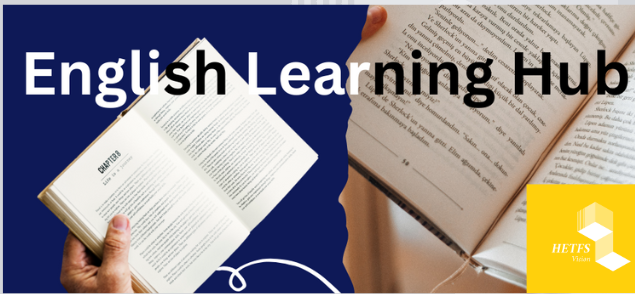
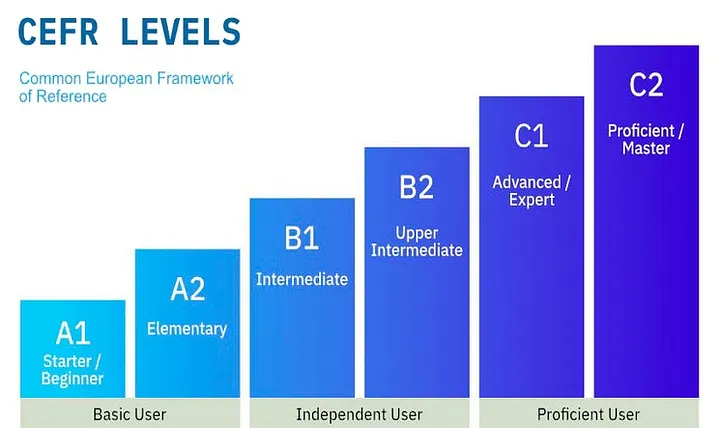
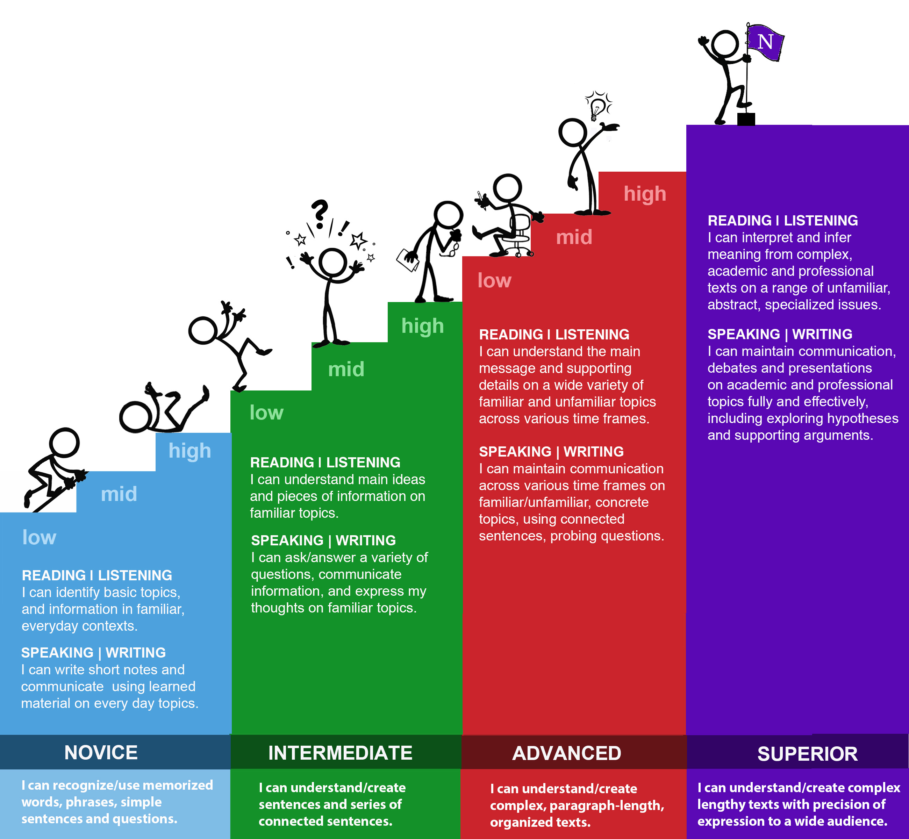

<<<<<<< HEAD
# Website

This website is built using [Docusaurus](https://docusaurus.io/), a modern static website generator.

### Installation

```
$ yarn
```

### Local Development

```
$ yarn start
```

This command starts a local development server and opens up a browser window. Most changes are reflected live without having to restart the server.

### Build

```
$ yarn build
```

This command generates static content into the `build` directory and can be served using any static contents hosting service.

### Deployment

Using SSH:

```
$ USE_SSH=true yarn deploy
```

Not using SSH:

```
$ GIT_USER=<Your GitHub username> yarn deploy
```

If you are using GitHub pages for hosting, this command is a convenient way to build the website and push to the `gh-pages` branch.
=======


# English Learning Hub

comprehensive platform for accelerating English language learning fluency with a native approach.

**Here's how it aligns with the criteria**:

1. **Structured Learning Path:** The repository provides a structured learning path covering grammar, vocabulary, listening, speaking, reading, and writing skills through organized modules and lessons.

2. **Interactive Content:** It includes interactive content such as video tutorials, audio recordings of native speakers, quizzes, and interactive exercises to engage learners actively.

3. **Authentic Materials:** Learners have access to authentic materials like native speaker conversations, interviews, podcasts, and articles, enabling them to immerse themselves in real-world English usage.

4. **Native Speakers as Instructors:** Native English speakers serve as instructors, offering authentic pronunciation, intonation, and colloquialisms to learners.

5. **Feedback and Correction:** Learners receive feedback and correction on their language production through automated tools, peer review, and community support forums.

6. **Cultural Context:** The repository includes cultural lessons and insights into English-speaking countries' customs, traditions, and everyday life, helping learners understand cultural nuances.

7. **Progress Tracking:** Learners can track their progress through progress tracking tools, quizzes, and assessments, receiving personalized recommendations based on their performance.

8. **Community Support:** The repository fosters a supportive community where learners can interact with peers, ask questions, share experiences, and participate in collaborative learning activities.

Overall,  this repository provides an effective platform for learners to accelerate their English language learning journey fluently and with a native approach.

## What Are the Different Levels for Learning a Language?

Language learning levels are often categorized based on standardized frameworks like the Common European Framework of Reference for Languages (CEFR) and the American Council on the Teaching of Foreign Languages (ACTFL).

Here are the typical levels:

<details>

<summary>CEFR Levels</summary>

- A1: Beginner
- A2: Elementary
- B1: Intermediate
- B2: Upper-intermediate
- C1: Advanced
- C2: Proficiency

</details>

<details>
<summary>2. ACTFL Levels:</summary>

- Novice
- Intermediate
- Advanced
- Superior

</details>



---

## Importance of Learning English

- **Global Communication**: English is the primary language of international communication, allowing individuals from different cultures to interact and collaborate effectively.
- **Career Opportunities**: Proficiency in English enhances employment prospects, as many multinational companies require English proficiency.
- **Access to Information**: English is the language of the internet, scientific research, and academic publications, providing access to a wealth of information and resources.
- **Cultural Understanding**: Learning English facilitates cultural exchange and understanding, as it enables individuals to engage with English literature, media, and cultural artifacts.

## Learning English Fast and Effectively

1. **Immerse Yourself**: Surround yourself with English by watching English movies, TV shows, listening to English music, and reading English books or articles. Immersion helps you absorb the language naturally  

2. **Practice Regularly**: Set aside time each day to practice English, whether it's through speaking, writing, reading, or listening. Consistent practice is key to improvement

3. **Use Language Learning Apps**: Utilize language learning apps like Duolingo, Babbel, or Rosetta Stone, which offer structured lessons and interactive exercises to improve your English skills.

4. **Engage in Conversations**: Practice speaking English with native speakers or language partners. Join English conversation groups, language exchange programs, or online forums to improve your speaking skills.

5. **Focus on Vocabulary and Grammar**: Build your vocabulary by learning new words and phrases every day. Also, pay attention to English grammar rules and practice using them correctly in sentences

6. **Set Clear Goals**: Define your learning objectives and set achievable goals. Whether it's passing a language proficiency exam or having a conversation with a native speaker, having clear goals helps you stay motivated and focused.

7. **Be Patient and Persistent**: Learning a new language takes time and effort. Be patient with yourself and celebrate your progress along the way. Stay persistent and keep practicing, even when it feels challenging.

---

## English Language Learning Roadmap

---
<details>

<summary>A1: Beginner</summary>

1. **Introduction to English:** Learn basic greetings, introductions, and simple expressions.
2. **Alphabet and Pronunciation:** Familiarize yourself with the English alphabet and basic pronunciation rules.
3. **Vocabulary Building:** Start with everyday words and phrases related to greetings, family, numbers, and common objects.
4. **Grammar Basics:** Understand simple sentence structures, present tense verbs, and basic question formation.
5. **Listening and Speaking:** Practice listening to and repeating simple phrases and questions.

</details>

---

<details>

<summary>A2: Elementary</summary>

1. **Expanding Vocabulary:** Add new words and expressions related to daily activities, hobbies, and interests.
2. **Grammar Development:** Introduce past and future tenses, prepositions, and basic conjunctions.
3. **Reading Comprehension:** Read short texts, signs, and simple stories to improve understanding.
4. **Writing Skills:** Form sentences and short paragraphs to describe experiences, routines, and future plans.
5. **Listening and Speaking Practice:** Engage in basic conversations, ask for directions, and exchange personal information.

</details>

---
<details>

<summary>B1: Intermediate</summary>

1. **Vocabulary Expansion:** Learn words and phrases related to work, travel, shopping, and social situations.
2. **Grammar Enhancement:** Master more complex sentence structures, verb forms, and conditional sentences.
3. **Reading Skills:** Understand longer texts, articles, and simplified literature.
4. **Writing Improvement:** Write emails, informal letters, and short essays on familiar topics.
5. **Listening and Speaking Development:** Participate in discussions, express opinions, and give presentations on familiar subjects.

</details>

---

<details>

<summary>B2: Upper intermediate</summary>

1. **Advanced Vocabulary:** Acquire vocabulary for professional settings, academic studies, and specialized interests.
2. **Grammar Refinement:** Perfect grammar skills, including advanced verb tenses, passive voice, and reported speech.
3. **Reading Proficiency:** Analyze and interpret complex texts, articles, and literature.
4. **Writing Mastery:** Craft well-structured essays, reports, and argumentative texts.
5. **Listening and Speaking Fluency:** Engage in debates, negotiations, and presentations on diverse topics.

</details>

---

<details>

<summary>C1: Advanced</summary>

1. **Specialized Vocabulary:** Develop vocabulary for specific fields such as business, science, or literature.
2. **Advanced Grammar:** Understand complex grammar structures, idiomatic expressions, and nuanced language use.
3. **Critical Reading:** Evaluate and synthesize information from academic texts, journals, and scholarly articles.
4. **Advanced Writing Skills:** Produce academic papers, research articles, and professional correspondence.
5. **Fluent Communication:** Participate confidently in debates, interviews, and academic discussions.

</details>

---

<details>

<summary>C2: Proficiency</summary>

1. **Near-Native Fluency:** Attain a level of fluency comparable to that of a native speaker.
2. **Cultural Competence:** Understand cultural nuances, idioms, and cultural references in English-speaking countries.
3. **Authentic Materials:** Engage with authentic materials such as literature, films, and media in English.
4. **Advanced Communication:** Express complex ideas, emotions, and opinions with precision and eloquence.
5. **Proficiency Assessment:** Take standardized tests such as the TOEFL or IELTS to certify language proficiency.

</details>

---

This roadmap provides a structured approach for learners to progress from basic proficiency to advanced mastery in the English language, gradually building their skills and confidence at each level.
Understanding the disparities among language proficiency levels from A1 to C2 is crucial for various reasons:

<details>

1. **Assessment and Placement:** Learners must accurately evaluate their language skills to determine their starting point and establish achievable improvement goals. Standardized tests, aligned with the Common European Framework of Reference for Languages (CEFR), assist language schools and programs in placing students in suitable classes.

2. **Goal Setting:** Recognizing the differences between beginner, intermediate, and advanced levels empowers learners to set specific language acquisition objectives. This clarity allows individuals to outline actionable steps towards progression, such as aiming to advance from A1 to A2 proficiency within a defined timeframe.

3. **Curriculum Development:** Educators utilize the CEFR framework to tailor curriculum and lesson plans to address specific language competencies at each proficiency level. This understanding enables teachers to adapt teaching methods, materials, and assessments to cater to learners' needs effectively.

4. **Self-Assessment:** Learners can independently evaluate their progress by referencing the CEFR descriptors for each proficiency level. This self-assessment enables individuals to identify strengths and areas requiring improvement, facilitating targeted self-study and practice.

5. **Communication and Collaboration:** In diverse language environments like language exchange programs or international workplaces, comprehension of proficiency levels ensures effective communication and collaboration. Awareness of someone's proficiency level allows for adjusted language use, promoting clearer understanding.

6. **Employment and Education Opportunities:** Many employers and educational institutions mandate proof of language proficiency at specific CEFR levels for admission, employment, or advancement. Understanding these distinctions empowers individuals to evaluate their eligibility for desired opportunities and undertake skill improvement measures if needed.

In summary, grasping the disparities among language levels facilitates effective language learning, goal establishment, curriculum design, self-assessment, communication, and accessing employment and educational prospects that necessitate language proficiency.

</details>

---

[**Free English level test • CEFR A1-C2**](https://www.englishradar.com/english-level-test/)

---

[**A1 BEGINNER**](Menus/A1-Menu.md)

---


>>>>>>> f822bcca2afff7725a856becb2904bd9b9ead0cb
